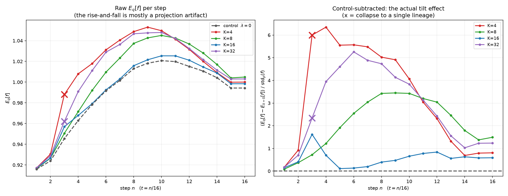
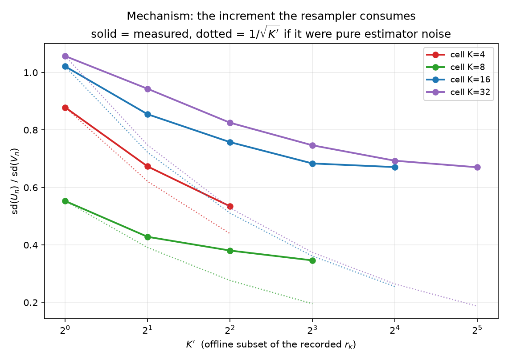
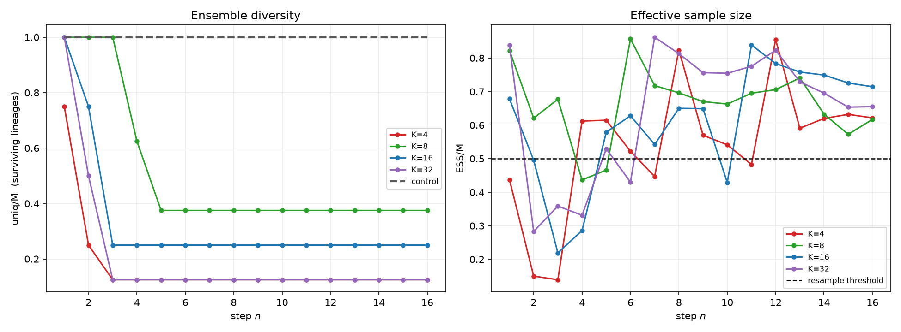
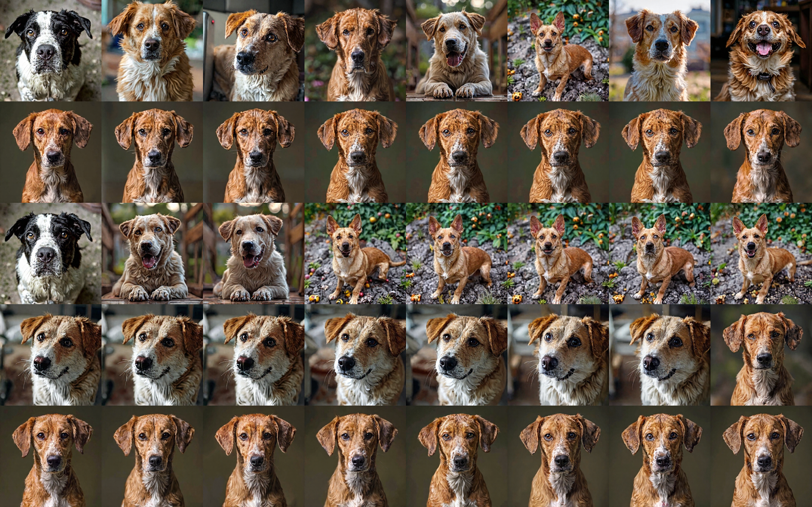

# Algorithm 3 — $K$ sweep at fixed $\lambda$ (2026-09-08/09)

**Question.** At one fixed medium $\lambda$, does raising the lookahead depth $K$ change the
within-run $E_{q}[f]$ curve, especially *before* the cloud degenerates?

**Setup (identical in every cell, only $K$ varies).** $\lambda = 175.12$ ($m = 1.25 \times
\lambda_{s}$, $\lambda_{s} = 140.093$), $M = 8$, seed 101, $N = 16$, $\eta = 1.5$,
`ess_threshold=0.5`, `guid_window=(0,1)`, `stoch_window=(0.1,1.0)`, branch 1, $R = 64$ refs,
all on L40S. Jobs 870213 (control), 870122, 870304, 869703, 869715.

$\operatorname{std}_{p}(f) = 0.0071$ is the unit for every difference below.

## Results

| $K$ | steps | terminal $E_{q}[f]$ | tilt effect vs control | uniq/M | resamples | collapse | $\operatorname{sd}(U)/\operatorname{sd}(V)$ |
|---|---|---|---|---|---|---|---|
| control ($\lambda = 0$) | 16 | 0.9943 | — | 1.000 | 0 | never | — |
| 4 | 16 | 1.0000 | $+0.81$ sd | 0.125 | 5 | step 3 | 0.534 |
| **8** | 16 | **1.0049** | **$+1.49$ sd** | **0.375** | **2** | never | **0.346** |
| 16 | 16 | 0.9985 | $+0.59$ sd | 0.250 | 4 | never | 0.671 |
| 32 | 16 | 1.0030 | $+1.23$ sd | 0.125 | 4 | step 3 | 0.670 |

**Terminal effect vs $K$: $0.81 \to 1.49 \to 0.59 \to 1.23$ — scatter, not a trend.** Seed sd is
$\approx 0.17$ sd (`flowmap_smc_max`, 3 seeds at $K{=}8$), so the spread exceeds seed noise, but the
ordering is not explained by $K$. $K{=}8$ being highest here is not a peak — $K{=}32$ is second.

**Control ($\lambda = 0$, no resampling, uniq/M = 1.00 throughout):** rises 0.9160 → peak
**1.0207 at step 10** → falls to **0.9943** at $t = 1$. Give-back $+0.0264 = 3.72$ sd **from no
tilt at all**.

**Offline $K'$ curves** (within-cell, same cloud, only $K'$ varies — the controlled comparison):

| cell | $K'{=}1$ | 2 | 4 | 8 | 16 | 32 | drop | $1/\sqrt{K}$ predicts |
|---|---|---|---|---|---|---|---|---|
| $K{=}4$ | 0.879 | 0.673 | 0.534 | | | | 1.64× | 2.00× |
| $K{=}8$ | 0.553 | 0.428 | 0.380 | 0.346 | | | 1.60× | 2.83× |
| $K{=}16$ | 1.021 | 0.855 | 0.758 | 0.683 | 0.671 | | 1.52× | 4.00× |
| $K{=}32$ | 0.965 | 0.938 | 0.869 | 0.752 | 0.696 | 0.683 | 1.41× | 5.66× |

**Peak → terminal decay:** $K{=}4$ $+4.91 \to +0.81$ sd (6×); $K{=}8$ $+3.43 \to +1.49$ sd (2.3×);
$K{=}32$ $+3.83 \to +1.23$ sd (3.1×). **The collapsed cells decay hardest** — $K = 4$ and $K = 32$
(both `uniq/M = 0.125`) lose 6× and 3.1×; $K = 8$ (0.375) loses 2.3×.

![E_q[f] per K](fig2_eqf_per_K.png)

## Decoded samples (job 871808)

Rows top→bottom: $\lambda = 0$ control (uniq 1.000), $K = 4$ (0.125), $K = 8$ (0.375),
$K = 16$ (0.250). Columns = the 8 particles at $t = 1$.

- **Control: 8 visibly different dogs** — different breeds, coats, poses, backgrounds.
- **$K = 4$:** 8 near-identical portraits of one dog. **$K = 8$:** 3 distinct scenes.
  **$K = 16$:** effectively 1 close-up.

**The run with the highest $E_{q}[f]$ produced 3 distinct images from 8 particles; the untilted
baseline produced 8.** The tilt bought $+1.49\operatorname{std}_{p}(f)$ of measured novelty at the
cost of two-thirds of the ensemble, and **no tilted row looks more creative than the control** — a
$+1.49$ sd move in a normalized IEM distance is not perceptible. *Caveat:* the control's 8 are
independent draws while the tilted rows are weighted particles, so some difference is expected by
construction; $M = 8$, one seed.

## Bottom line

**Established (measured, artifact-free):**

1. **The within-run rise-and-fall of $E_{q}[f]$ is largely a projection artifact.** It appears in full at $\lambda = 0$ with no tilt,
   no resampling and an intact cloud (give-back 3.72 sd). $f$ evaluated on $\operatorname{map}(x_{t}, t, 1)$ overrates intermediate-$t$ estimates.
   **Raw within-run curves cannot be read without subtracting the control.**
2. **$\operatorname{sd}(U)/\operatorname{sd}(V)$ does not follow $1/\sqrt{K'}$.** Measured drop stays $\approx 1.5\times$ while the prediction grows to $5.66\times$;
   both the $K{=}16$ and $K{=}32$ cells plateau at $\approx 0.67$. This holds *within* each cell, so it is not confounded by cloud state.
3. **At $t = 1$ (where the artifact is exactly zero), the tilt effect has no trend in $K$:**
   $+0.81 \to +1.49 \to +0.59 \to +1.23$ sd for $K = 4, 8, 16, 32$ — scatter over a $0.6$–$1.5$ sd
   band, with $K{=}32$ second-best. $K{=}8$ was highest here and also kept the most diversity, but
   with four points and no monotone ordering that is a property of this seed, not of $K$.
4. **Collapse inflates $E_{q}[f]$.** Single-lineage cells ($K = 4, 32$) show the largest mid-trajectory effects and the steepest decay. Never read $E_{q}[f]$ without `uniq/M`.

**Assumed / not established:**

- **That $K \approx 8$ is optimal — NOT established; with $K = 32$ complete it is contradicted.**
   Terminal effects are $0.81 / 1.49 / 0.59 / 1.23$ sd, so $K = 32$ is *second-best* and there is no
   peak at 8. Seed sd is $\approx 0.17$ sd, so the spread is real but its ordering is not explained
   by $K$. **$K$ also does not predict collapse:** $K = 4$ and $K = 32$ collapsed at step 3,
   $K = 8$ and $K = 16$ did not. What *is* solid is the saturation in (2): $K$ above $\approx 8$
   buys nothing on the mechanism metric, and nothing here shows it buying anything on the outcome.
- **That the $\approx 0.67$ floor is genuine $V$ movement** (hence CRN's target). This is the natural reading of a variance floor that $K$ cannot lower,
   but it has not been measured directly.
- $K{=}32$ never reached $t = 1$ (still runs); its $+1.56$ sd is a step-13 single-lineage value, not comparable.

## Which $K$ to use in future runs

**Default to $K = 4$.** The only $K$-vs-$K$ comparison free of seed luck is the *within-cell*
$K' = 4 \to 8$ step (same cloud, only $K'$ varies):

| cell | $K'{=}4$ | $K'{=}8$ | gain |
|---|---|---|---|
| $K{=}8$ | 0.380 | 0.346 | 8.9% |
| $K{=}16$ | 0.758 | 0.683 | 9.9% |
| $K{=}32$ | 0.869 | 0.752 | 13.5% |

$\approx 10\%$ lower increment noise for **1.77×** the compute (measured 3.09 h vs 5.48 h; 12.2 vs
21.6 min/step — sublinear because of fixed overheads). The tempting terminal gap ($+1.49$ vs
$+0.81$ sd) is one seed and is not reliable, and $K = 8$ does **not** protect against collapse.

- **$K = 4$** — default; 56% of the cost for $\approx 10\%$ more increment noise.
- **$M = 16, K = 4$** — same cost as $M = 8, K = 8$, and targets degeneracy, which is what actually
  broke every cell here. Untested on FLUX; the toy trended this way.
- **$K = 8$** — only for a final decisive run where the cleanest twist matters and cost does not.
- **$K \ge 16$** — ruled out.

## Next steps

1. **Consider implementing CRN (Fix 2) and re-run at $K = 8$.** Raising $K$ is ruled out by (2).
2. Consider $M$ over $K$: at equal cost $M \cdot K$, the toy trended toward larger $M$, and every failure here was degeneracy at $M = 8$.
